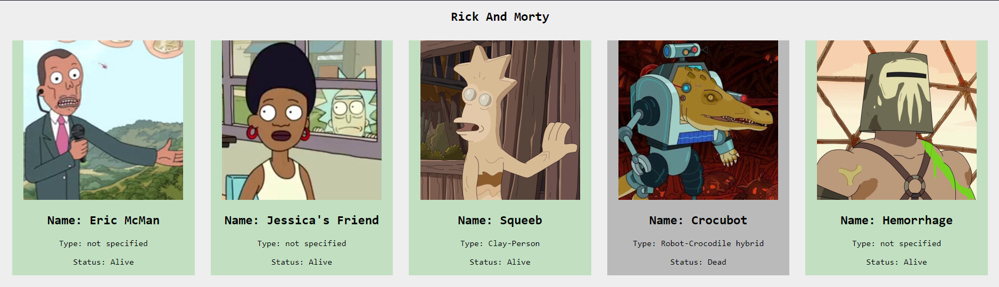

# Desenvolvimento orientado à objeto - Rick and Morty

Este projeto simples foi desenvolvido pensando no tratamento de classe e objeto via Javascript para a criação do personagem no front-end. 

## 🚀 Explicando o projeto

Neste projeto utilizamos uma API pública do [Rick and Morty](https://rickandmortyapi.com/) para trazer os personagens e suas caracteristicas para nosso projeto. Para a representação dos projeto no Front-End foi utilizado uma classe 'Character' à qual recebe como argumento as informações necessárias (URL da imagem do personagem, nome, tipo e status). Após isso, foi implementado uma função chamada **"generateHTML()"** à qual tem a função de utilizar as informações salvas para criar o HTML e inserir na página via Javascript.

## 🎁 Considerações finais

* Divulgue a ideia e vamos crescer juntos! 📢
* Ideia criativa: [Maria Ferreira](https://github.com/mariferreira00).

---
por [André Bez Birolo](https://github.com/AndreBezBirolo) 
